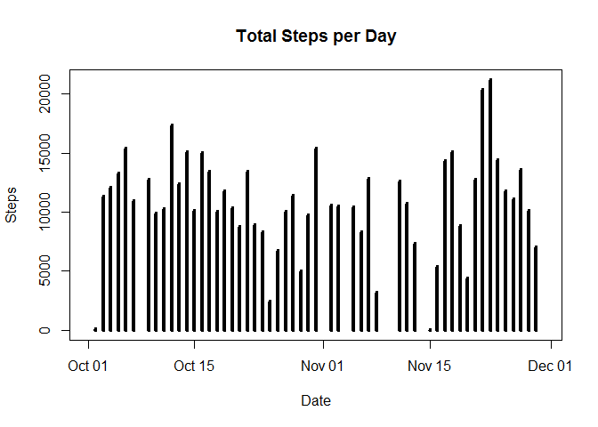
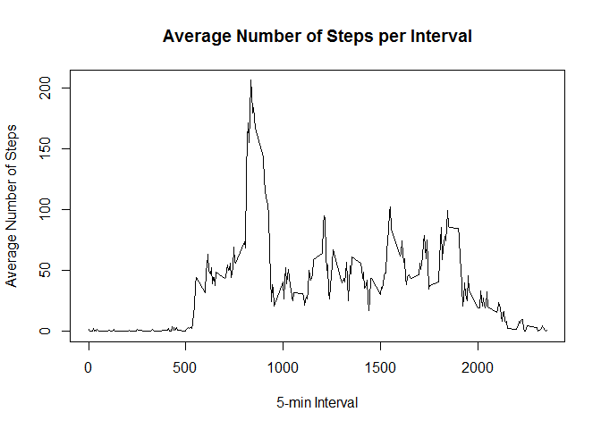
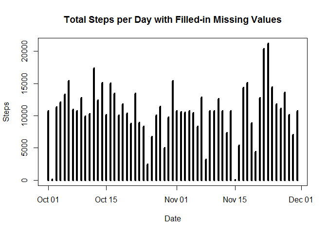
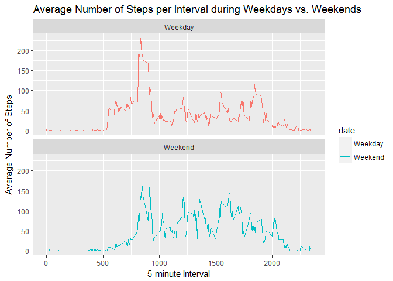

# Reproducible Research: Peer Assessment 1


### 1. Summary
This assignment makes use of data from a personal activity monitoring device. This device collects data at 5 minute intervals through out the day. The data consists of two months of data from an anonymous individual collected during the months of October and November, 2012 and include the number of steps taken in 5 minute intervals each day.

The data for this assignment can be downloaded from the course web site:

Dataset: [Activity monitoring data](https://d396qusza40orc.cloudfront.net/repdata%2Fdata%2Factivity.zip) [52K]

The variables included in this dataset are:

1. steps: Number of steps taking in a 5-minute interval (missing values are coded as NA)
2. date: The date on which the measurement was taken in YYYY-MM-DD format
3. interval: Identifier for the 5-minute interval in which measurement was taken

The dataset is stored in a comma-separated-value (CSV) file and there are a total of 17,568 observations in this dataset.


### 2. Loading and preprocessing the data

Show any code that is needed to:

1. Load the data (i.e. read.csv()).
2. Process/transform the data (if necessary) into a format suitable for your analysis.


```r
# Download file
fileurl <- "https://d396qusza40orc.cloudfront.net/repdata%2Fdata%2Factivity.zip"
destfile <- "activity.zip"
if(!file.exists(destfile)) {
    download.file(fileurl, destfile)
    unzip(destfile)
}

# Load dataset
activity <- read.csv("./activity.csv")

# Convert date field into readable dates
activity$date <- as.Date(activity$date)
```


### 3. What is mean total number of steps taken per day?

For this part of the assignment, you can ignore the missing values in the dataset.

1. Calculate the total number of steps taken per day. If you do not understand the difference between a histogram and a barplot, research the difference between them. Make a histogram of the total number of steps taken each day.


```r
# Load library
library(reshape2)

# Melt the steps data by date
steps.melt <- melt(activity, id.vars="date", measure.vars="steps", na.rm=FALSE)

# Cast the data frame to steps per day
steps.day <- dcast(steps.melt, date ~ variable, sum)

# Create the histogram
plot(steps.day$date, steps.day$steps, type="h", main="Total Steps per Day", xlab="Date", ylab="Steps", lwd=4)
```

<!-- -->

2. Calculate and report the mean and median of the total number of steps taken per day.


```r
# Aggregate steps
steps.aggregate <- aggregate(steps ~ date, activity, sum)

# Find mean and median steps; print them out
steps.mean <- mean(steps.aggregate$steps); steps.median <- median(steps.aggregate$steps);
steps.printout <- rbind(steps.mean,steps.median)
colnames(steps.printout) <- c("Total Steps Per Day"); rownames(steps.printout) <- c("Mean", "Median")
print(steps.printout)
```

```
##        Total Steps Per Day
## Mean              10766.19
## Median            10765.00
```

As the table shows, mean value of steps per day is `10766.19` and median value of steps per day is `10765.00`.


### 4. What is the average daily activity pattern?

1. Make a time series plot (i.e. type = "l") of the 5-minute interval (x-axis) and the average number of steps taken, averaged across all days (y-axis).


```r
# Load libraries
library(plyr)
library(ggplot2)

# Sum the steps
steps.interval <- aggregate(steps ~ interval, activity, FUN=mean, na.rm=TRUE)

# Plot the time series plot
plot(steps.interval, type="l", main="Average Number of Steps per Interval", xlab="5-min Interval", ylab="Average Number of Steps")
```

<!-- -->

2. Which 5-minute interval, on average across all the days in the dataset, contains the maximum number of steps?


```r
# Calculate using max function
steps.interval[steps.interval$steps==max(steps.interval$steps),]
```

```
##     interval    steps
## 104      835 206.1698
```

As the plot shows, `interval #835` showed the maximum amount of average number of steps at `206 steps`.


### 5. Imputing missing values

Note that there are a number of days/intervals where there are missing values (coded as NA). The presence of missing days may introduce bias into some calculations or summaries of the data.

1. Calculate and report the total number of missing values in the dataset (i.e. the total number of rows with NAs)


```r
# Calculate using nrow function
nrow(activity[is.na(activity$steps),])
```

```
## [1] 2304
```

As the table shows, the total number of missing values in the dataset is `2304`.

2. Devise a strategy for filling in all of the missing values in the dataset. The strategy does not need to be sophisticated. For example, you could use the mean/median for that day, or the mean for that 5-minute interval, etc.

3. Create a new dataset that is equal to the original dataset but with the missing data filled in.


```r
# Retrieve the average number of steps per interval calculated from Section 4.1; store the "activity" dataset into a new dataset
head(steps.interval, 3) # preview
```

```
##   interval     steps
## 1        0 1.7169811
## 2        5 0.3396226
## 3       10 0.1320755
```

```r
activity.filled <- activity

# Fill in the new dataset using for loop that matches average steps per interval to the interval number for the missing value
for(i in 1:nrow(activity.filled)) {
    if(is.na(activity.filled[i,c("steps")])){
        activity.filled[i,c("steps")] <-
            steps.interval[steps.interval$interval==activity.filled[i,c("interval")],c("steps")]
    }
}

head(activity.filled, 3) # preview
```

```
##       steps       date interval
## 1 1.7169811 2012-10-01        0
## 2 0.3396226 2012-10-01        5
## 3 0.1320755 2012-10-01       10
```

4. Make a histogram of the total number of steps taken each day and calculate and report the mean and median total number of steps taken per day. Do these values differ from the estimates from the first part of the assignment? What is the impact of imputing missing data on the estimates of the total daily number of steps?


```r
# Load libraries
library(plyr)
library(ggplot2)
library(reshape2)

# Melt the steps data by date
steps.melt2 <- melt(activity.filled, id.vars="date", measure.vars="steps", na.rm=FALSE)

# Cast the data frame to steps per day
steps.day2 <- dcast(steps.melt2, date ~ variable, sum)

# Create the histogram
plot(steps.day2$date, steps.day2$steps, type="h", main="Total Steps per Day with Filled-in Missing Values", xlab="Date", ylab="Steps", lwd=4)
```

<!-- -->

```r
# Aggregate steps to calculate mean and median values
steps.aggregate2 <- aggregate(steps ~ date, activity.filled, sum)

# Find mean and median steps
steps.mean2 <- mean(steps.aggregate2$steps); steps.median2 <- median(steps.aggregate2$steps);
steps.printout2 <- rbind(steps.mean2,steps.median2)
colnames(steps.printout2) <- c("Total Steps Per Day"); rownames(steps.printout2) <- c("Mean", "Median")

# Combine original mean & median table and the filled-in table
steps.compare <- cbind(steps.printout, steps.printout2)
colnames(steps.compare) <- c("Original","Filled-In")

# Print out
print(steps.compare)
```

```
##        Original Filled-In
## Mean   10766.19  10766.19
## Median 10765.00  10766.19
```

Since the mean value from each interval was taken to fill in the mean value has not changed (value stayed at `10766.19`). However, the median value from original dataset increased `1.19` from `10765` to `10766.19`.

### 6. Are there differences in activity patterns between weekdays and weekends?

For this part the weekdays() function may be of some help here. Use the dataset with the filled-in missing values for this part.

1. Create a new factor variable in the dataset with two levels - "weekday" and "weekend" indicating whether a given date is a weekday or weekend day.


```r
# Convert dates in the dataset into respective days of the week
activity.filled$date <- weekdays(as.Date(activity.filled$date))

# Using for loop, convert the day of the week into either weekday or weekend
for(i in 1:nrow(activity.filled)) {
    if(activity.filled[i,c("date")]=="Saturday"|
       activity.filled[i,c("date")]=="Sunday") {
        activity.filled[i,c("date")] <- "Weekend"
    } else {
        activity.filled[i,c("date")] <- "Weekday"
    }
}

head(activity.filled, 3) # preview
```

```
##       steps    date interval
## 1 1.7169811 Weekday        0
## 2 0.3396226 Weekday        5
## 3 0.1320755 Weekday       10
```

2. Make a panel plot containing a time series plot (i.e. type = "l") of the 5-minute interval (x-axis) and the average number of steps taken, averaged across all weekday days or weekend days (y-axis). See the README file in the GitHub repository to see an example of what this plot should look like using simulated data.


```r
# Load library
library(ggplot2)

# Aggregate the data and organize the average number of steps per interval and date 
summary <- aggregate(steps ~ interval + date, activity.filled, FUN=mean)

# Plot using ggplot
ggplot(summary, aes(interval,steps, color=date)) +
    facet_wrap(~date, ncol=1) +
    geom_line() +
    xlab("5-minute Interval") +
    ylab("Average Number of Steps") +
    labs(title="Average Number of Steps per Interval during Weekdays vs. Weekends") +
    guides(fill=FALSE)
```

<!-- -->
